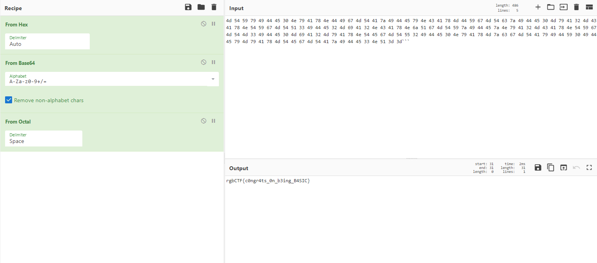

# **rgbCTF 2020**

<div align='center'>
  
</div>
an online infosecurity competition organized by the [RGBsec CTF team](https://rgbsec.xyz/). rgbCTF features jeopardy style cyber/infosecurity challenges in various categories including cryptography, binary exploitation, forensics, web exploitation, and more. The objective is simple, solve as many challenges as possible within the 48 hour competition timer to rack up points and scale the leaderboard.

This is my writeup for the challenges in rgbCTF 2020, I participated alone in this CTF so I could have time to make a writeup, feel free to message me on Discord or make an issue on GitHub if you have any question or found any mistake, thanks for reading!


****

# Table of Contents

* [Beginner](#Beginner)
  * [Sanity Check](#sanity-check)
  * [Joke Check!](#joke-check!)
  * [A Basic Challenge](#a-basic-challenge)
  * [A Fine Day](#a-fine-day)
  * [r/chiphers](#r/ciphers)
  * [Simple RSA](#simple-rsa)
  * [Pieces](#pieces)
  * [Quirky Resolution](#quirky-resolution)
  * [Shoob](#shoob)
* [Cryptography](#cryptography)
  * [I Love Rainbows](#i-love-rainbows)
  * [e](#e)
  * [Occasionally Tested Protocol](#occasionally-tested-protocol)
  * [Shakespeare Play, Lost (and found!)](#shakespeare-play,-lost-(and-found!))
* [Misc](#misc)
  * [Differences](#differences)
  * [Hallo?](#hallo?)
  * [Picking Up The Pieces](#picking-up-the-pieces)
  * [Ye Old PRNG](#ye-old-prng)

***

# Beginner


## Sanity Check

rgbCTF{g0_g3t_th4t_j4m!}

**Hint!** What, you want it in a pastebin or something? [https://pastebin.com/raw/4AYxW9Ec](https://www.youtube.com/watch?v=dQw4w9WgXcQ)


**`rgbCTF{g0_g3t_th4t_j4m!}`**

**Solution:** If you're looking for a writeup for this challenge, I think you should go to the optometrist


## Joke Check!

What do you call a chicken staring at lettuce?

[punchline.txt](assets//documents//punchline.txt)


**`rgbCTF{a_chicken_caesar_salad}`**

**Solution:** With the challenge we are given a text file containing the following string:

```
crmNEQ{l_nstnvpy_nlpdlc_dlwlo}
```

The string bares a similarity to the format of the flag, this typically means that the string is encrypted using a substitution cipher, I will not go to details about what is a cipher though I strongly suggests you to learn the basics yourself, in a broad sense a cipher is a protocol by which we can make data unreadable to others without who have no knowledge of the cipher or the components that were used (e.g. the key), using ciphers we can communicate through an insecure medium such as the internet without the data transferred being readable by all or save data in an insecure place so that only we can use the data, the cipher consists of an encryption scheme and a decryption scheme, the encryption converts the data to code and the decryption inverts the action of the decryption, in other words it retrieves the data from the code.

substitution ciphers are ciphers where each letters in the text is replaced by another letter using a system of rules, commonly only letters in the alphabet are encrypted using substitution ciphers so we can gain knowledge from the ciphertext (the data after encryption) about the plaintext (the data itself) such as inferring the type of cipher or the some attributes of the data (length for example).

The cipher is actually a Caesar's cipher, in this encryption scheme every letter is replaced by a letter with a fixed offset from it in the alphabet with wrap around, for example if our offset is 3 then the letter 'z' will be replaced by 'c', a' will be replaced by 'd', 'b' will be replaced by 'e' and so on, the decryption scheme is the same in the opposite direction, this cipher is sometimes called shift cipher or ROT13 (which is a Caesar's cipher with offset of 13 but it is sometimes used to name the cipher itself), I actually guessed that this is a Caesar's cipher but equivalently I could have just checked the offset of the start of the string from the flag format and infer from there, A popular tool for data analysis and data manipulation is a site called CyberChef (linked in the resources), plugging the string and going through all the offsets and checking for the flag format we get the flag:


**Resources:**

* CyberChef: https://gchq.github.io/CyberChef/
* A great site to learn the basics of cryptography:  https://cryptohack.org/

## A Basic Challenge

This is a nice and basic challenge.

[basic_chall.txt](assets//documents//basic_chall.txt)

**` rgbCTF{c0ngr4ts_0n_b3ing_B4SIC}`**

**Solution:** With the challenge we are given a text file with the following data:

```
110100 1100100 100000 110101 110100 100000 110101 111001 100000 110111 111001 100000 110100 111001 100000 110100 110100 100000 110100 110101 100000 110011 110000 100000 110100 1100101 100000 110111 111001 100000 110100 110001 100000 110111 111000 100000 110100 1100101 100000 110100 110100 100000 110100 111001 100000 110110 110111 100000 110100 1100100 100000 110101 110100 100000 110100 110001 100000 110111 1100001 100000 110100 111001 100000 110100 110100 100000 110100 110101 100000 110111 111001 100000 110100 1100101 100000 110100 110011 100000 110100 110001 100000 110111 111000 100000 110100 1100100 100000 110100 110100 100000 110101 111001 100000 110110 110111 100000 110100 1100100 100000 110101 110100 100000 110110 110011 100000 110111 1100001 100000 110100 111001 100000 110100 110100 100000 110100 110101 100000 110011 110000 100000 110100 1100100 100000 110111 111001 100000 110100 110001 100000 110011 110010 100000 110100 1100100 100000 110100 110011 100000 110100 110001 100000 110111 111000 100000 110100 1100101 100000 110101 110100 100000 110101 111001 100000 110110 110111 100000 110100 1100100 100000 110101 110100 100000 110101 110001 100000 110011 110011 100000 110100 111001 100000 110100 110100 100000 110100 110101 100000 110011 110010 100000 110100 1100100 100000 110110 111001 100000 110100 110001 100000 110011 110010 100000 110100 1100101 100000 110100 110011 100000 110100 110001 100000 110111 111000 100000 110100 1100101 100000 110110 1100001 100000 110101 110001 100000 110110 110111 100000 110100 1100100 100000 110101 110100 100000 110101 111001 100000 110111 1100001 100000 110100 111001 100000 110100 110100 100000 110100 110101 100000 110111 1100001 100000 110100 1100101 100000 110111 111001 100000 110100 110001 100000 110011 110010 100000 110100 1100100 100000 110100 110011 100000 110100 110001 100000 110111 111000 100000 110100 1100101 100000 110101 110100 100000 110101 111001 100000 110110 110111 100000 110100 1100100 100000 110101 110100 100000 110100 1100100 100000 110011 110011 100000 110100 111001 100000 110100 110100 100000 110100 110101 100000 110011 110000 100000 110100 1100100 100000 110110 111001 100000 110100 110001 100000 110011 110010 100000 110100 1100100 100000 110111 111001 100000 110100 110001 100000 110111 111000 100000 110100 1100101 100000 110101 110100 100000 110100 110101 100000 110110 110111 100000 110100 1100100 100000 110101 110100 100000 110101 110101 100000 110011 110010 100000 110100 111001 100000 110100 110100 100000 110100 110101 100000 110011 110000 100000 110100 1100101 100000 110111 111001 100000 110100 110001 100000 110111 111000 100000 110100 1100100 100000 110111 1100001 100000 110110 110011 100000 110110 110111 100000 110100 1100100 100000 110101 110100 100000 110100 110001 100000 110111 111001 100000 110100 111001 100000 110100 110100 100000 110101 111001 100000 110011 110000 100000 110100 111001 100000 110100 110100 100000 110100 110101 100000 110111 111001 100000 110100 1100100 100000 110111 111001 100000 110100 110001 100000 110111 111000 100000 110100 1100100 100000 110101 110100 100000 110100 110101 100000 110110 110111 100000 110100 1100100 100000 110101 110100 100000 110100 110001 100000 110111 1100001 100000 110100 111001 100000 110100 110100 100000 110100 110101 100000 110011 110011 100000 110100 1100101 100000 110101 110001 100000 110011 1100100 100000 110011 1100100
```

The data only consists of 0 and 1, so we can infer that the data is encoded using 0's and 1's, there are three common encoding for that: binary, morse and bacon. If we decode the data from binary value to decimal value and encode the numbers to ascii characters we get the following:

```
4d 54 59 79 49 44 45 30 4e 79 41 78 4e 44 49 67 4d 54 41 7a 49 44 45 79 4e 43 41 78 4d 44 59 67 4d 54 63 7a 49 44 45 30 4d 79 41 32 4d 43 41 78 4e 54 59 67 4d 54 51 33 49 44 45 32 4d 69 41 32 4e 43 41 78 4e 6a 51 67 4d 54 59 7a 49 44 45 7a 4e 79 41 32 4d 43 41 78 4e 54 59 67 4d 54 4d 33 49 44 45 30 4d 69 41 32 4d 79 41 78 4e 54 45 67 4d 54 55 32 49 44 45 30 4e 79 41 78 4d 7a 63 67 4d 54 41 79 49 44 59 30 49 44 45 79 4d 79 41 78 4d 54 45 67 4d 54 41 7a 49 44 45 33 4e 51 3d 3d
```

This looks like data encoding using hex, a type of encoding that consists of digits and the letters from A to F and encoded numbers in base 16, encoding from hex to ascii characters again we get a strings which consists of letters, numbers and symbols:

```
MTYyIDE0NyAxNDIgMTAzIDEyNCAxMDYgMTczIDE0MyA2MCAxNTYgMTQ3IDE2MiA2NCAxNjQgMTYzIDEzNyA2MCAxNTYgMTM3IDE0MiA2MyAxNTEgMTU2IDE0NyAxMzcgMTAyIDY0IDEyMyAxMTEgMTAzIDE3NQ==
```

This is base64 encoded data, encoding the data to ascii characters we get number with digits from 0 to 7:

```
162 147 142 103 124 106 173 143 60 156 147 162 64 164 163 137 60 156 137 142 63 151 156 147 137 102 64 123 111 103 175
```

This is by the range of the digits octal encoded data, and encoding again to ascii we get the flag:



**Resources:**

* Character encoding: https://en.wikipedia.org/wiki/Character_encoding
* base: https://en.wikipedia.org/wiki/Radix

## A Fine Day

It's a fine day to break some ciphers!

```
Sujd jd bgxopksbm ljsu tg tqqjgb xjkubo. Tqqjgb xjkubod tob t qvor vq dhidsjshsjvg xjkubo. Jsd nbp xvgdjdsd vq slv ghribod, t tgm i. Sv bgxopks t cbssbo, rhcsjkcp jsd kctxb jg sub tckutibs (dv t=0, i=1, bsx.) ip t, tgm subg tmm i. Qjgtccp stnb suts rvm 26 tgm xvgwbos js itxn jgsv t xutotxsbo.
Sub tqqjgb xjkubo jdg's obtccp suts dsovgf. Djgxb js'd rvm 26, subob tob vgcp t qbl uhgmobm mjqqbobgs nbpd, lujxu xtg ib btdjcp iohsb qvoxbm. Tgpltp, ubob'd pvho qctf: ofiXSQ{t_qjgb_tqqjgb_xjkubo}
```

**`rgbCTF{a_fine_affine_cipher}`**

**Solution:** With the challenge we get an unreadable strings of characters, we can guess again from the the similarity between the last word and the flag format that this is a substitution cipher, and by the name of the challenge we can also infer that the data is encrypted using an affine cipher.

this cipher works similarly to Caesar's cipher, if we name the position of some letter in the alphabet with x, then Caesar's cipher replaces that character with the character in the x + b (mod 26) position where b is the offset as we've seen before, but the affine cipher replaces that character with the character in the ax + b (mod 26) position where a and b are some fixed values, for encrypting I used the site dcode.fr which uses bruteforce to automatically decrypt the data, by doing so we get the following decrypted message and the flag:

```
The affine cipher isn't really that strong. Since it's mod 26, there are only a few hundred different keys, which can be easily brute forced. Anyway, here's your flag: rgbCTF{a_fine_affine_cipher}
```

**Resources:**

* Affine Cipher: https://en.wikipedia.org/wiki/Affine_cipher

* dcode.fr Affine Cipher: https://www.dcode.fr/affine-cipher


## r/ciphers

RGBsec does not endorse (or really even know at this point) what the content is on that sub reddit.
(It's just the title of the challenge)

[11.txt](assets//documents//11.txt)

**`rgbCTF{just_4sk_th3_int3rn3t_t0_d3crypt_it}`**

**Solution:** Monoalphabetic substitution cipher


## Simple RSA

Can you find a way to attack this RSA implementation?

[simple_rsa.txt](assets//documents//simple_rsa.txt)\
[simple_rsa.py](assets//scripts//simple_rsa.py)


**`rgbCTF{brut3_f0rc3}`**

**Solution:** Find factors online, brute force domain of both primes (I guess)

```python
from sympy import mod_inverse
from Crypto.Util.number import long_to_bytes
from math import gcd

def lcm(a: int, b: int) -> int:
    return a * b // gcd(a, b)

n = 5620911691885906751399467870749963159674169260381
e = 65537
c = 1415060907955076984980255543080831671725408472748
p = 255097177
q = 22034393943473183756163118460342519430053


lmbd = lcm(p - 1, q - 1)
d = mod_inverse(e, lmbd)
m = pow(c, d, n)
print(long_to_bytes(m)[::-1])
```

## Pieces

My flag has been divided into pieces :( Can you recover it for me?

[Main.java](assets//scripts//Main.java)

**`rgbCTF{restinpieces}`**

**Solution:** Reverse code

```python
def encrypt_divide(cipher):
	for c,s in zip(cipher[::2], cipher[1::2]):
		p = ord(c) * 2
		p = p if s == "|" else p + 1
		print(chr(p),end='')

encrypt_divide("9|2/9/:|4/7|8|4/2/1/2/9/")
```

## Quirky Resolution

":joy:"

[quirky_resolution.png](assets//images//quirky_resolution_1.png)


**`rgbCTF{th3_qu1rk!er_th3_b3tt3r}`**


**Solution:** Change color balance, QR code

Before:

After:


## Shoob

s h o o b

[shoob.png](assets//images//shoob.png)

**`rgbCTF{3zier_4haN_s4n1ty}`**


**Solution:** change color balance (using stegsolve for example)

Before:


After:


***

# Cryptography

## I Love Rainbows

Can you figure out why?

[rainbows.txt](assets//documents//rainbows.txt)

**`rgbCTF{4lw4ys_us3_s4lt_wh3n_h4shing}`**

**Solution:** hashes of each letter in the flag, crackstation

 ## e
 n = 0x5fb76f7f36c0d7788650e3e81fe18ad105970eb2dd19576d29e8a8697ebbd97f4fc2582bf1dc53d527953d9615439ca1b546b2fc1cd533db5fce6f72419f268e3182c0324a631a17d6b3e76540f52f2df51ca34983392d274f292139c28990660fa0e23d1b350da7aa7458a3783107a296dcd1720e32afb431954d8896f0587cd1c8f1d20701d6173b7cffe53679ebda80f137c83276d6628697961f5fcd39e18316770917338c6dc59a241dcdc66417fed42524c33093251c1d318b9dbeb6c3d0a69438b875958e8885d242d196e25bc73595e7f237c8124e07a79f7066f2dee393e2130306ba29e7ece1825798ff8b35416b3a0d96bcdc6eca5616ea2874954f8f88232450ddad3e109338bcc5d84e7b592a6b0871bd4130b84f81ed188e9d5495c8545aa8dea2b65e8605f5a49e3a1c221cbcc301665187658784a8f42a23c2ca2572477ba56ff19934019b48f5a1ab8a50626c85bdd476b11e8c1fb0b740c2370de3da5cc06371a7aa2c4e12eee3dc4cda07a8c84ba2bc3ee2017156468af95111d7ee5152ce35e66fa027a944b43c27fbd27faa5b4f9075be3526a7a5be8a533b523cd5c738c724e97597fc2e3666cfcad7c79d972ff8d9572100e860395cdc3761af3f4cc225a6df83a55802723f95cfba5918d83913f2cc9b219210249928c291310d449042772e2d0a50620d666a137f79770de6f10196b30cc756e1\
 e = 0b1101\
 c = 0x6003a15ff3f9bc74fcc48dc0f5fc59c31cb84df2424c9311d94cb40570eeaa78e0f8fc2917addd1afc8e5810b2e80a95019c88c4ee74849777eb9d0ee27ab80d3528c6f3f95a37d1581f9b3cd8976904c42f8613ee79cf8c94074ede9f034b61433f1fef835f2a0a45663ec4a0facedc068f6fa2b534c9c7a2f4789c699c2dcd952ed82180a6de00a51904c2df74eb73996845842276d5523c66800034351204b921d4780180ca646421c61033017e4986d9f6a892ed649c4fd40d4cf5b4faf0befb1e2098ee33b8bea461a8626dd8cd2eed05ccd471700e2a1b99ed347660cbd0f202212f6c0d7ad8ef6f878d887af0cd0429c417c9f7dd64890146b91152ea0c30637ce503635018fd2caf436a12378e5892992b8ec563f0988fc0cebd2926662d4604b8393fb2000

**`rgbCTF{lucky_number_13}`**

**Solution:** Low exponent attack

```python
import gmpy2
from Crypto.Util.number import long_to_bytes

e = 0b1101
c = 0x6003a15ff3f9bc74fcc48dc0f5fc59c31cb84df2424c9311d94cb40570eeaa78e0f8fc2917addd1afc8e5810b2e80a95019c88c4ee74849777eb9d0ee27ab80d3528c6f3f95a37d1581f9b3cd8976904c42f8613ee79cf8c94074ede9f034b61433f1fef835f2a0a45663ec4a0facedc068f6fa2b534c9c7a2f4789c699c2dcd952ed82180a6de00a51904c2df74eb73996845842276d5523c66800034351204b921d4780180ca646421c61033017e4986d9f6a892ed649c4fd40d4cf5b4faf0befb1e2098ee33b8bea461a8626dd8cd2eed05ccd471700e2a1b99ed347660cbd0f202212f6c0d7ad8ef6f878d887af0cd0429c417c9f7dd64890146b91152ea0c30637ce503635018fd2caf436a12378e5892992b8ec563f0988fc0cebd2926662d4604b8393fb2000

print(long_to_bytes(gmpy2.iroot(c,e)[0])[::-1])
```

## Occasionally Tested Protocol

But clearly not tested enough... can you get the flag?

`nc 167.172.123.213 12345`


**`rgbCTF{random_is_not_secure}`**

**Solution:** Weak seed using current time as integer, we can bruteforce seed.

```python
from random import seed,randint
from time import time
from pwn import remote
from re import findall

host, port = '167.172.123.213', 12345

s = remote(host, port)

# find the current time for the seed
time = int(time())

# recieves the numbers from the server
numbers = findall("[0-9]+", str(s.recvuntil("Here's another number I found:")))[1:]
numbers = [int(n) for n in numbers]
cipher = int(findall("[0-9]+", str(s.recv()))[0])

# finds the server's seed using the received numbers
for i in range(-60,60):
	seed(time + i)
	predicted_numbers = []

	# gets 10 random numbers and compares them to the numbers given from the server,
	# if the seed is the same as the server, the numbers will be equal
	for i in range(10):
	    predicted_numbers.append(randint(5, 10000))

	# checks if the numbers are equal, if not moves to the next seed
	if len([1 for i,j in zip(numbers, predicted_numbers) if i != j]) > 0:
		continue

	print("seed is {}".format(time + i))

	# finds the bytearray the server uses and decrypts the message
	b = bytearray([randint(0, 255) for _ in range(40)])
	n = (cipher).to_bytes( (cipher.bit_length() + 7) // 8, byteorder='little')
	g = [ l ^ p for l, p in zip(n, b)]
	print(''.join([chr(c) for c in g]))

s.close()
```

## Shakespeare Play, Lost (and found!)

Did you know RGBsec was founded in the 16th century? Our top notch team of RGBsec archaeologists has uncovered this ancient manuscript to prove it. There also were some numbers inscribed beside this manuscript, they might help you. Unfortunately, flag formats hadn't been invented yet, so you will need to enclose the flag in the flag format.

[play](assets//documents//play)\
[some_numbers.txt](assets//documents//some_numbers.txt)

**`rgbCTF{itsanrgbtreeeeeee!}`**


**Solution:** the numbers are positions in the play

```python
positions = [
(33, 20),
(71, 5),
(43, 142),
(60, 150),
(73, 312),
(78, 66),
(15, 22),
(12, 115),
(29, 18),
(51, 147),
(45, 68),
(34, 14),
(54, 126),
(15, 48),
(3, 4),
(60, 126),
(45, 77),
(13, 69),
]

play = open('play', 'r').readlines()
print(play)
for i,j in positions:
	print(play[i][j],end='')
```

***

# Misc

## Differences

If a difference could difference differences from differences to calculate differences, would the difference differently difference differences to difference the difference from different differences differencing?

[DifferenceTest.java](assets//documents//DifferenceTest.java)

**`rgbCTF{tr1pl3_m34n1ng}`**

**Solution:** Find Difference between given code to fixed code

 ```
imporæ ÑÃva.util.*;
pžbli· class DifferenceTest {
	pub²ic static void main(String[Ø args) {
		Scanner çÕ = Ÿew ScanÞÑr(SyŠÓem.in);
		System.out.priná("Enter first number: ");
		int num1 = sc.nextInt();
		System.out.pri¡t("Enter second ¢umber: ");
		int num2 = sc.nexâIŸt();
		int answer = num1 - num2;
		Áystem.out.×rintln("The difference is: " + answer);
	}
ú
 ```


```java
import java.util.*;
public class DifferenceTest {
	public static void main(String[] args) {
		Scanner sc = new Scanner(System.in);
		System.out.print("Enter first number: ");
		int num1 = sc.nextInt();
		System.out.print("Enter second number: ");
		int num2 = sc.nextInt();
		int answer = num1 - num2;
		System.out.println("The difference is: " + answer);
	}
}
```

```python
file1 = open("DifferenceTest.java", 'rb').read()
file2 = open("DifferenceTestFixed.java", 'rb').read()
file3 = [chr(l - p) for l,p in zip(file1,file2) if l ^ p != 0]
print(''.join([c for c in file3]))
```


## Hallo?

The flag is exactly as decoded. No curly brackets.

NOTE: keep the pound symbols as pound symbols!

[hmm.mp3](assets//audio//hmm.mp3)


**`rgbctf#yeet#dtmf#tones#`**

**Solution:** DTMF tones using phone key layout


## Picking Up The Pieces

Can you help me? I had a flag that I bought at the store, but on the way home, I dropped parts of it on some roads! Now some roads have strings of text, and I can't tell which are part of my flag. I'm very smart and efficient (but somehow not smart or efficient enough to keep my flag), so I know that I took the fastest way from the store back to my house.

I have a map with a list of all 200000 roads between intersections, and what strings are on them. The format of the map is <intersection 1> <intersection 2> <distance> <string on the road>. My house is at intersection 1 and the store is at intersection 200000.

[map.txt](assets//documents//map.txt)

**`rgbCTF{1m_b4d_4t_sh0pp1ng}`**

**Solution:** Using dijeksra to find shortest path from 1 to 200000, first attempt (inefficient):
```python
from os import chdir
import numpy as np

map = open('map.txt', 'r').read().splitlines()
map = [tuple(c.split(' ')) for c in map]

intersections = np.array([[c[0], c[1]] for c in map]).flatten()
intersections = np.unique(intersections)
dist = {c: np.inf for c in intersections}
prev = {c: None for c in intersections}
dist['1'] = 0

while intersections is not []:
    dist = {k: v for k, v in sorted(dist.items(), key=lambda item: item[1])}
    print(len(intersections))

    u, d = [(k, v) for k, v in dist.items()][0]
    intersections = np.delete(intersections, np.where(intersections == u))


    print(u, d)
    if u == '200000':
        break

    neighbors = [e for e in map if e[1] == u or e[0] == u]
    for n in neighbors:
        alt = d + int(n[2])
        v = n[0] if n[1] == u else n[1]

        if v in dist and alt < dist[v]:
            dist[v] = alt
            prev[v] = u

    del dist[u]

v = '200000'
while v != '1':
    print(prev[v])
    print([c for c in map if (c[0] == v and c[1] == prev[v]) or (c[1] == v and c[0] == prev[v])])
    v = prev[v]

```
second attempt using scipy and sparse matrices:

```python
from scipy.sparse.csgraph import dijkstra
import numpy as np
from scipy import sparse
map = open('map.txt', 'r').read().splitlines()
map = [tuple(c.split(' ')) for c in map]
row_ind = np.array([int(e[0]) for e in map])
col_ind = np.array([int(e[1]) for e in map])
data = np.array([int(e[2]) for e in map])


mat = sparse.coo_matrix((data, (row_ind, col_ind)), shape=(200001, 200001))
_, pred = dijkstra(mat, directed=False, return_predecessors=True, indices=[1])

flag = []
v = 200000
while v != 1:
    u = pred[0][v]
    flag.append([e for e in map if (str(u) == e[0] and str(v) == e[1]) or (str(v) == e[0] and str(u) == e[1])][0][3])
    v = u
print(''.join(flag[::-1]))

```

## Ye Old PRNG
I found a really old prng... can you exploit it? `nc challenge.rgbsec.xyz 23456`

**`rgbCTF{d0nt_us3_midd13_squ4r3}`**

**Solution:** This is an old prng called middle squared method (according to wikipedia)

```python
from pwn import remote
from re import findall
host, port = 'challenge.rgbsec.xyz', '23456'

s = remote(host, port)
s.recv()
s.send('2\n')

while True:
	response  = s.recv()
	print(response)
	seed = int(findall('[0-9]+', str(response))[0])
	n = len(str(seed))
	ans = seed ** 2
	pad = len(str(ans)) - n

	if pad % 2 == 1:
		ans = '0' + str(ans)
		d = int((pad + 1) / 2)
	else:
		ans = str(ans)
		d = int(pad / 2)

	ans = ans[d : -d]
	s.send(ans + '\n')

```
